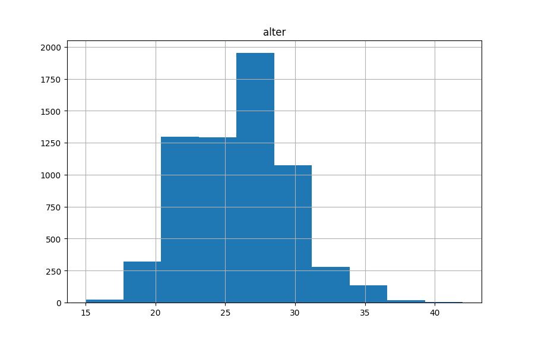

## Trockenübungen

1. Das SESISPI-Prinzip soll als Bewertungsmaßstab den Abgleich zwischen Soll und Ist von Daten erleichtern. Was sagt es aus?
1. Wofür sind Histogramme nutzbar?
1. Wie lassen sich Daten nach ihrer Darstellungsweise unterteilen. Nennen Sie jeweils Beispiele.
1. Beschreiben Sie die Unterschiede zwischen Urheber- und Nutzungsrecht.
1. Was regeln die Datenbankrechte?
1. In der Datenschutzgrundverordnung (DSGVO) ist der Umgang mit personenbezogenen Daten geregelt. Nennen Sie mindestens drei zentrale Bestandteile daraus.
1. Was ist Ethik?
1. Daten unterscheiden sich (deutlich) nach ihrer Genese. Welche Typen sind Ihnen dabei bekannt. Beschreiben Sie eines davon genauer (Potenzial, Einschränkungen, rechtliche Grundsätze, ethische Prinzipien).

## Praxisübungen

### Instagram-Abos

Laden Sie den [Instagram-Abo-Datensatz](https://raw.githubusercontent.com/datenfruehstueck/ccs/main/03_Daten-bewerten/instagram-abos.csv) wie beim [letzten Mal](https://github.com/datenfruehstueck/ccs/02_Daten-sichten/).

1. Zählen Sie die Anzahl der darin enthaltenen Merkmalsträger. 
1. Zählen Sie die Anzahl der unterschiedlichen Geschlechter (und ihrer fehlenden Werte).
1. Finden Sie heraus, wie viele User:innen im Datensatz dem Account *Funk* folgen.
1. Können Sie das Durchschnittsalter (arithm. Mittel, ggf. zzgl. Standardabweichung) im Datensatz herausfinden?
1. Und auch das Durchschnittsalter (arithm. Mittel, ggf. zzgl. Standardabweichung) jener, die dem Account *Funk* folgen?

### Histogramme

Nun wollen wir uns endlich Histogrammen widmen. Dafür setzen wir zunächst auf den **erstwaehlende.csv**-Datensatz aus den letzten Übungen. Wenn das also noch nicht läuft, dann machen Sie sich zunächst erneut [damit](https://github.com/datenfruehstueck/ccs/02_Daten-sichten/) vertraut. 

In R sind wir dann bereits dafür direkt startklar, in Python müssen wir noch die Bibliothek *matplotlib* installieren (Terminal in PyCharm: `pip install matplotlib`) und im Skript einbinden (`import matplotlib.pyplot as plt`). Anschließend wählen wir das gewünschte Merkmal aus (hier: Alter) und weisen an, ein Histogramm auszuspucken. Den Rest übernehmen die Bibliotheken und Pakete für uns.

```python
# Python
import matplotlib.pyplot as plt
plt.figure()
erstwaehlende.hist('alter')
plt.show()
```

```r
# R
erstwaehlende %>%
  pull(alter) %>%
  hist()
```

1. Beschreiben Sie das Histogramm und die so betrachteten Daten.
1. Erstellen Sie ein Histogramm für das Alter in den Instagram-Abo-Daten.
1. Beschreiben Sie die Instagram-Abo-Daten -- was lässt sich hier über das Alter sagen?
1. Wie verhalten sich die beiden Datensätze in Bezug auf ihr Alter zueinander?

### Daten umformen

Im nächsten Schritt wollen wir die Instagram-Abo-Daten so umformen, dass die Accounts die neuen Merkmalsträger sind. Die jetzigen Spalten sollen also zu Zeilen werden. In den Spalten soll dann die Anzahl an User:innen stehen, die dem jeweiligen Account folgen. 

Das sieht auf den ersten Blick komplizierter aus als es ist: Im Wesentlichen müssen wir die Spalten der Accounts (von *AfD* bis *xLaeta*) in Zeilen überführen und anschließend die Anzahl der User:innen, die eine `1` in der jeweiligen Zelle stehen hatten, aufsummieren. Das Ergebnis schreiben wir in eine neue Variable namens `insta_abo_accounts`.

```python
# Python
insta_abo_account_names = insta_abos.loc[1, 'AfD':'xLaeta'].index
insta_abo_accounts = insta_abos.melt(id_vars = 'user', value_vars = insta_abo_account_names, var_name = 'account', value_name = 'follow')
insta_abo_accounts = insta_abo_accounts[['account', 'follow']].groupby('account').agg({'follow': 'sum'})
insta_abo_accounts
```

```r
# R
insta_abo_accounts <-
  insta_abos %>% 
  pivot_longer(AfD:xLaeta,
               names_to = 'account',
               values_to = 'follow') %>% 
  group_by(account) %>% 
  summarise(follow = sum(follow))
insta_abo_accounts
```

Versuchen Sie nun, eine neue Variable zu bilden, in der ebenfalls die gefolgten Accounts die Merkmalsträger / Zeilen bilden, die aber nicht eine Follow-Spalte, sondern drei aufweist:

- `d` soll die Anzahl an diversen User:innen enthalten, die dem Account folgen
- `m` soll die Anzahl männlicher User enthalten, die dem Account folgen
- `w` soll die Anzahl weiblicher Userinnen enthalten, die dem Account folgen

## Lösungsansätze

Ab hier folgen nun verschiedene Lösungswege zu den oben vorgestellten Übungen. Damit Sie die nicht "versehentlich" überscrollen und so Ihrer Übungsmöglichkeiten beraubt werden, folgt hier zunächst ein visueller Bruch.


### Trockenübungen

1. Siehe Unterlagen.
1. Zur visuellen Beschreibung aller vorhandenen Merkmalsausprägungen bei (quasi-)metrischen Merkmalen.
1. Unterteilung in ...
   - Querschnittsdaten (z.B. einmalige Befragung, Sonntagsfrage, Polit-Barometer, einmalige Online-Umfrage)
   - Längsschnittdaten oder Zeitreihen (z.B. Tracking-Daten, Insta-Abo-Daten zu mehreren Zeitpunkten)
   - Relationale Daten (z.B. Netzwerke, Mehr-Ebenen-Daten, verschachtelte Daten, Online-Diskussionsforums-Threads, Follow-Netzwerke, Beiträge von Medien in unterschiedlichen Ländern)
1. Urheberrechte schützen automatisch generierende Instanz und können nicht übertragen werden. Nutzungsrechte erlauben Verwendung urheberrechtlich geschützter Güter.
1. Erlauben systematische Sammlung von Daten Dritter, sofern Datenbankerstellung gewissen Aufwand mit sich bringt.
1. Suche Sie sich was aus:
   - Auskunftsrecht
   - Löschanspruch ("Recht auf Vergessen")
   - Notwendigkeit der informierten Zustimmung
   - nur zweckgebundene Erhebung
   - Recht auf Privatsphäre
   - Schutz vor Datenzugriff Dritter
1. Teil der Moral (insbes. Anwendung moralischen Handelns), Summe der Normen und Werte einer Gesellschaft
1. Siehe Unterlagen.


### Praxisübungen

#### Instagram-Abos

1. 6397
1. 303d, 2300m, 3473w, 321 fehlend
1. 2983 folgen dem Account
1. M = 26.0 (SD = 3.61)
1. M = 26.5 (SD = 3.74)

#### Histogramme

1. Linkssteil / Rechtsschief, Bodeneffekte, die Erstwählenden sind (wohl aufgrund der Definition als "Erstwählende") überwiegend 18 mit einigen 19-, 20- und 21-Jährigen, die seit der letzten Wahl Geburtstag hatten. 
1. 
1. Nahezu normalverteilt, um einen Mittelwert von 26. Insgesamt also eher jüngeres Publikum. Leicht linksschief / rechtssteil.
1. In beiden Fällen eher jüngeres Publikum, wobei User:innen im Insta-Datensatz im Mittel 6.9 Jahre älter sind. Insta-Publikum außerdem tendenziell breiter vertreten, während Erstwählende sehr zugespitzt als Zielgruppe im Datensatz vertreten sind. Im Insta-Datensatz sind außerdem (mehr) Minderjährige enthalten. 

#### Daten umformen

Viele Wege führen hier ans Ziel. Ein Beispiel bildet der folgende R-Code. Um zu sehen, ob Ihr Weg das gewünschte Ergebnis gebracht hat, finden Sie hier außerdem einige resultierende Zahlen.

```r
# R
insta_abo_accounts_geschlechter <-
  insta_abos %>% 
  pivot_longer(AfD:xLaeta,
               names_to = 'account',
               values_to = 'follow') %>% 
  group_by(account, geschlecht) %>% 
  summarise(n = sum(follow)) %>% 
  ungroup() %>% 
  pivot_wider(names_from = geschlecht,
              values_from = n)
```

| account | d | m | w |
| --- |:---:|:---:|:---:|
| adidas | 184 | 1381 | 2102 |
| AfD | 129 | 1003 | 1565 |
| Ajkune Professional | 185 | 1397 | 2115 |
| ... | ... | ... | ... |
