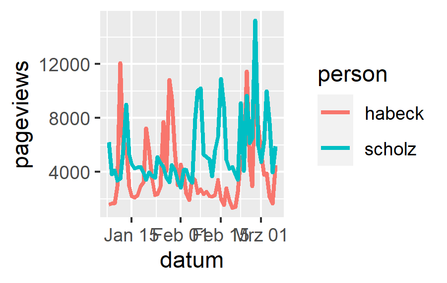

## Trockenübungen

1. Warum stellen uns Andere (z.B. Intermediäre) Daten zur Verfügung?
1. Wer stellt Daten potenziell zur Verfügung?
1. Was sind verzerrte Daten und wie kommt es dazu?
1. APIs sind ein sehr zentrales Konstrukt der CCS. Beschreiben Sie, was es damit auf sich hat.
1. Nennen Sie mindestens drei Anbieter von APIs, die für die CCS von Relevanz sein könnten.

## Praxisübungen

### Datenbanken

Um die Struktur von Datenbanken nachvollziehbar dokumentieren zu können, greift man üblicherweise auf Entity-Relationship-Diagramme zurück. Erstellen Sie ein solches "ERD" (am Einfachsten ist das von Hand mit Zettel und Stift) nach den folgenden Vorgaben:

- Es sollen gesammelte Online-Nachrichtenartikel (nur Texte) von unterschiedlichen Medien verwaltet werden.
- Jeder Artikel besteht aus einem Titel, dem Text und einer/einem Autor:in. Autor:innen sind frei, gehören also keinem Medium dezidiert an. 
- Ein Medium hat einen Namen, eine Postanschrift und eine URL. 
- Autor:innen haben Vor- und Nachnamen sowie eine E-Mail-Adresse. Jede:r Autor:in kann mehrere Artikel verfasst haben. Außerdem können auch mehrere Autor:innen an einem Artikel gemeinsam arbeiten. Die Autor:innenreihenfolge spielt dabei keine Rolle.
- Artikel erscheinen bei verschiedenen Medien. Ein Artikel kann auch bei mehreren Medien erscheinen. Eine solche Erscheinung ist immer auch mit einem Erscheinungsdatum versehen.

Denken Sie beim Zeichnen an aussagekräftige Merkmalsbezeichnungen und passende Beziehungen.

### SQL

Die Abfragesprache **SQL** lernt sich spielerisch und am einfachsten mithilfe der Lern-Plattform [SQL Island](https://sql-island.informatik.uni-kl.de/).

Auf Basis des ERDs zu den Artikel von Autor:innen, die bei diversen Medien erscheinen (siehe dazu die Lösungsansätze am Ende dieser Seite), formulieren Sie SQL-Anfragen zu den folgenden Aufgaben:

1. Alle Artikel auflisten, alphabetisch nach Titel sortiert.
1. Die ID des Autoren Max Müller ausfindig machen.
1. Alle Artikel-IDs auflisten, an denen Max Müller (autorin_id: `21`) mitgearbeitet hat.
1. Alle Medien in Berlin auflisten.
1. Alle Artikel, die von Max Müller (mit-)verfasst wurden und im Spiegel (medium_id: `42`) erscheinen, nach Erscheinungstermin sortieren (optional: mit Titel und Text).

### APIs

Die Wikipedia bietet über ihre API Zugriff auf Aufrufzahlen. Das sind Angaben über die tägliche Anzahl an Seitenaufrufen, die bestimmte Seiten erhalten. Das Resultat liefert Ergebnisse der letzten 60 Tage (oder wahlweise weniger). Wir wollen die Seitenaufrufzahlen für die Wikipedia-Seite des Bundeskanzlers abrufen und den Zahlen für die Wikipedia-Seite des Gesundheitsministers gegenüberstellen.

Die API ist [hier](https://de.wikipedia.org/w/api.php) umfassend und der spezifische PageViewInfo-Endpunkt ist [hier](https://www.mediawiki.org/wiki/Extension:PageViewInfo#API) im Speziellen dokumentiert. Zentral sind die folgenden Aspekte:

- API-URL: `https://de.wikipedia.org/w/api.php`
- Endpunkt: `prop=pageviews&action=query&format=json`
- Abfrage / Query: `titles=Olaf_Scholz|Karl_Lauterbach`

Die eigentliche Abfrage kann aus Python oder R ausgeführt werden und liefert in beiden Fällen Daten im JSON-Format zurück. Einen Einblick in die retournierte Datenstruktur liefert Wikipedia selbst, wenn man die gesamte API-Anfrage im Browser ausführt und dabei den Format-Parameter weglässt: [https://de.wikipedia.org/w/api.php?action=query&prop=pageviews&titles=Olaf_Scholz|Karl_Lauterbach](https://de.wikipedia.org/w/api.php?action=query&prop=pageviews&titles=Olaf_Scholz|Karl_Lauterbach)

Für R sind dabei keine zusätzlichen Pakete notwendig, denn alle benötigten Teile sind bereits (über das *tidyverse*) installiert. In Python müssen Sie noch requests installieren (`pip install requests`). Die größte Herausforderung dabei ist, das etwas verschachtelte Rückgabeformat in eine ordentlich lesbare Tabellenstruktur zu überführen. Für beide Programmiersprachen ist der Code hier entsprechend vorgegeben.

```python
# Python
import pandas as pd
import requests

request = requests.get(url = 'https://de.wikipedia.org/w/api.php',
                       params = {'prop': 'pageviews',
                                 'action': 'query',
                                 'format': 'json',
                                 'titles': 'Olaf_Scholz|Karl_Lauterbach'})

lauterbach = request.json()['query']['pages']['975589']['pageviews']
scholz = request.json()['query']['pages']['293388']['pageviews']

pd.DataFrame(list(zip(lauterbach.keys(), 
                      lauterbach.values(),
                      scholz.values())),
             columns = ['datum', 'lauterbach', 'scholz'])
```

```r
# R
library(tidyverse)
library(httr)
library(jsonlite)

request <- GET(url = 'https://de.wikipedia.org/w/api.php',
               query = list(prop = 'pageviews',
                            action = 'query',
                            format = 'json',
                            titles = 'Olaf_Scholz|Karl_Lauterbach'))
response <- 
  request %>% 
  content(as = 'text') %>% 
  fromJSON()

tibble(datum = names(response$query$pages$`975589`$pageviews),
       lauterbach = unlist(response$query$pages$`975589`$pageviews),
       scholz = unlist(response$query$pages$`293388`$pageviews))
```

1. Wiederholen Sie Prozedere für Kanzler und Vizekanzler. Speichern Sie die resultierende Tabelle in einer Variable namens `aufmerksamkeitsduell`.
1. Berechnen Sie die arithmethischen Mittelwerte der Anzahlen an Seitenaufrufen je Person und vergleichen Sie.

### Visualisierung

Da wir nun so anschauliche Daten vor uns haben, wollen wir diese Daten hier auch noch visualisieren. Das ist nur als Einstieg in die Visualisierung von großen Datenmengen gedacht, sodass Sie Anhaltspunkte haben, wonach Sie online recherchieren können. Konkret wollen wir die zwei Datenreihen -- die des Kanzlers und die des Vizekanzlers -- jeweils als Linien in einem Diagramm über die Zeit darstellen. 

In **Python** und mit **Pandas** genügt es, wenn wir eine Spalte zum *Index* machen und anschließend einfach die `plot()`-Funktion aufrufen. Das ist sehr einfach, die optischen Möglichkeiten sind mit Python aber auch begrenzt.

```python
import matplotlib.pyplot as plt
plt.figure()
aufmerksamkeitsduell.set_index('datum').plot.line()
plt.show()
```


In **R** läuft die Visualisierung über **ggplot2**, ein Paket, das mit dem *tidyverse* bereits installiert wurde. Dabei müssen die Daten im Long-Format vorliegen und für das Paket müssen zudem alle Aspekte der Grafik genau definiert werden. Das sieht auf den ersten Blick komplexer aus, kann aber mit deutlich mehr Konfigurationsmöglichkeiten umgehen.

```r
aufmerksamkeitsduell %>% 
  pivot_longer(c(habeck, scholz),
               names_to = 'person',
               values_to = 'pageviews') %>% 
  mutate(datum = as.Date(datum)) %>% 
  ggplot(aes(x = datum,
             y = pageviews,
             color = person)) +
  geom_line(size = 1)
```



1. Visualisieren Sie den Gesundheitsminister als dritte Linie dazu.
1. Anstelle von Linien, die einen gewissen Zeitverlauf suggerieren, wären tägliche Balken visuell akkurater (aber womöglich auch unübersichtlicher). Visualisieren Sie zum Vergleich die Daten mithilfe von Balken.
1. Ändern Sie die Farben der Linien in Rot (Scholz) und Grün (Habeck).
1. Stellen Sie fest, dass Rot und Grün für Rot-Grün-Blinde nicht ideal ist und suchen Sie sich beim [Colorbrewer](https://colorbrewer2.org/) ein tauglicheres Farbpaar für zwei qualitativ unterschiedliche Klassen. Wenden Sie die neuen Farben auf Ihre Grafik an.
1. Ergänzen oder Ändern Sie sinnvolle (z.B. wöchentliche) Hilfslinien im Hintergrund. 
1. Passen Sie die X-Achsen-Beschriftung an die Hilfslinien an.
1. Verschieben Sie die Legende nach unten.
1. Geben Sie den Achsenbeschriftungen aussagekräftigere Namen.

## Lösungsansätze

Ab hier folgen nun verschiedene Lösungswege zu den oben vorgestellten Übungen. Damit Sie die nicht "versehentlich" überscrollen und so Ihrer Übungsmöglichkeiten beraubt werden, folgt hier zunächst ein visueller Bruch.


### Trockenübungen

1. Siehe Unterlagen.
1. Siehe Unterlagen.
1. Siehe Unterlagen.
1. Siehe Unterlagen.
1. Nahezu alle Intermediäre und viele weitere:
   - Deutscher Bundestag
   - Face++
   - Facebook
   - Google Translate
   - Instagram
   - Reddit
   - Twitter
   - Wikipedia
   - YouTube

### Praxisübungen

#### Datenbanken


1. ```sql
   SELECT * 
   FROM artikel 
   ORDER BY titel ASC
   ```
1. ```sql
   SELECT autorin_id 
   FROM autorin 
   WHERE vorname = "Max" 
     AND nachname = "Müller"
   ```
1. ```sql
   SELECT artikel_id 
   FROM autorin_je_artikel 
   WHERE autorin_id = 21
   ```
1. ```sql
   SELECT * 
   FROM medium 
   WHERE stadt = "Berlin"
   ```
1. ```sql
   SELECT artikel.artikel_id,
          artikel_in_medium.erscheinungstermin,
          artikel.titel,
		  artikel.text
   FROM artikel_in_medium 
   LEFT JOIN artikel 
          ON artikel_in_medium.artikel_id = artikel.artikel_id
   WHERE artikel_id IN (SELECT artikel_id 
                        FROM autorin_je_artikel 
	                    WHERE autorin_id = 21)
     AND medium_id = 42
   ORDER BY erscheinungstermin ASC
   ```

#### APIs

1. Der Code ist genau derselbe. Ändern Sie die Namen und die Zahl von Lauterbach (`975589`) auf die Seiten-ID von Robert Habeck, die Sie aus der JSON-Antwort oder von Wikipedia selbst auslesen können (`1569620`). 
1. Das Ergebnis hängt natürlich davon ab, wann Sie die Anfrage durchführen. Bei mir beträgt der gerundete Durchschnittswert des Kanzlers derzeit 5470 Wikipedia-Seitenaufrufe pro Tag. Der des Vizekanzlers liegt mit 3936 deutlich darunter.
