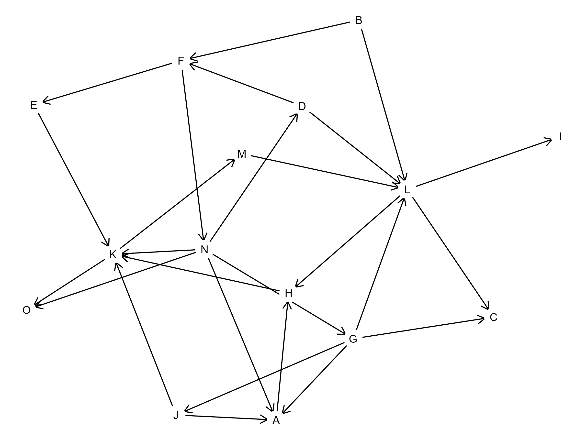

## Trockenübungen

1. Netzwerke, also die soziale Darstellung von Knoten und Kanten, lassen sich insbesondere auf zwei Dimensionen jeweils in zwei Gruppen einteilen. In welche?
1. Wie berechnet sich in ungewichteten Graphen die Distanz?
1. Was beschreibt die Nähenzentralität / Closeness?
1. Was sagt eine hohe Transitivität über einen Graphen aus?
1. Der Durchmesser eines fiktiven Netzwerks beträgt 24. Lässt sich etwas darüber aussagen, wie viel das ist?
1. Was ist "community detection"?

## Praxisübungen

Beantworten Sie die folgenden Fragen (ggf. von Hand) zu diesem Graphen:

1. Um was für eine Art von Graphen handelt es sich?
1. Ermitteln Sie die Anzahl an Knoten, Kanten und die Dichte.
1. Ermitteln Sie für den Knoten *N* dessen In- und Outdegree.
1. Unter Berücksichtigung der gerichteten Kanten (also nur "in Fahrtrichtung"), wie hoch ist die Distanz zwischen *F* und *C*?
1. Finden Sie auch den Durchmesser des Graphen?
1. Welches ist der Knoten mit der höchsten Zwischenzentralität (Betweenness)?

### Links

Um soziale Netzwerkdaten mit Python oder R umzusetzen, gibt es mittlerweile soviel Literatur und soviel angepasste Übungen (online), dass dieser Komplexität mit ein paar Übungen hier nicht gerecht werden würde. Stattdessen soll gute Literatur hier entsprechend gewürdigt und verlinkt werden:

- Eine tiefergehende und frei verfügbare theoretische Einführung bieten [Omar Lizardo und Isaac Jilbert](https://bookdown.org/omarlizardo/_main/).
- Eine SNA-Einführung mit Beispielen in Python und R bieten [van Atteveldt, Trilling und Arcila](https://cssbook.net/content/chapter13.html)
- Einführungen in R bieten etwa [Josephine Lukito](https://bookdown.org/josephine_lukito/bookdown-demo/igraph.html) oder [Mark Hoffman](https://bookdown.org/markhoff/social_network_analysis/).
- Das gut lesbare [tidygraph-Paket](https://www.data-imaginist.com/2017/introducing-tidygraph/) enthält ebenfalls über eine Einführung.
- Für Python lohnen sich etwa die Einführungen von [Jan Kirenz](https://www.kirenz.com/post/2019-08-13-network_analysis/) oder [William Mattingly](https://python-textbook.pythonhumanities.com/06_sna/06_01_02_basics.html).

## Lösungsansätze

Ab hier folgen nun verschiedene Lösungswege zu den oben vorgestellten Übungen. Damit Sie die nicht "versehentlich" überscrollen und so Ihrer Übungsmöglichkeiten beraubt werden, folgt hier zunächst ein visueller Bruch.

### Trockenübungen

1. Gerichtet/Ungerichtet (sind die Kanten Pfeile oder einfach nur Linien) und gewichtet/ungewichtet (sind Kanten unterschiedlich viel wert, also zB dicker/dünner).
1. Als kürzeste Anzahl der Kanten, die notwendig sind, um von einem bestimmten Knoten zu einem bestimmten anderen Knoten zu gelangen.
1. Als Maß beschreibt sie die möglichst nahe Distanz zu möglichst vielen anderen Knoten. Inhaltlich interpretierbar ist sie als Maß der (starken) Vernetzung.
1. Zunächst einen hohen Anteil "vollständiger" Dreiecksbeziehungen (alle drei Knoten sind mit allen anderen beiden Knoten vernetzt). Inhaltlich interpretierbar sind solche Graphen als Netzwerke mit hohem (sozialem) Zusammenhalt, also wahrscheinlich einer großen Nähe und Ähnlichkeit.
1. Jein. Typischerweise sind Netzwerke mit Menschen als Knoten dichter, sodass der Durchmesser in der Regel ein- oder niedrig zweistellig (zB 6-12) ist.
1. Eine Verfahrensfamilie zur automatisierten Erkennung von Gruppen/Clustern.

### Praxisübungen

1. Einen gerichteten aber ungewichteten Graphen. 
1. 15 Knoten, 26 Kanten, d = 0,12 (12% aller möglichen Kanten).
1. Indegree = 1 (eine eingehende Kante), Outdegree = 4 (vier ausgehende Kanten).
1. 3 (F > N > G > C).
1. Der Durchmesser beträgt hier 5.
1. K, mit einer Zwischenzentralität von 30 (bei Berücksichtigung der gerichteten Kanten, also nur "in Fahrtrichtung). 